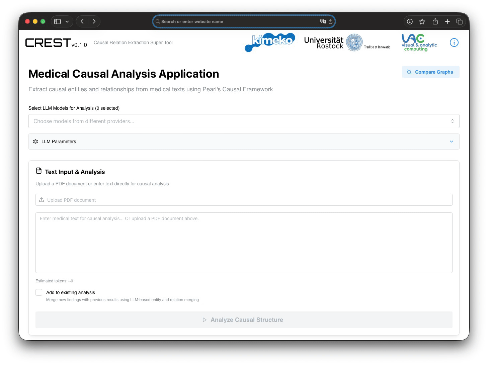

# CREST: Causal Relation Extraction Super Tool

## Technical Report on a Research Prototype for Medical Causal Analysis

**Authors:** Dr. Robin Nicolay

**Institution:** Institute for Visual and Analytic Computing, University of Rostock, Germany

**Project:** KiMeKo - Aufbau einer norddeutschen KI-Med-Kollaborationsplattform (TP4)

**Funding:** Federal Ministry of Research, Technology and Space (BMFTR) of Germany, Grant No. 01IS24056D

**Date:** January 2026


*Figure 1: CREST user interface.*

---

## Abstract

This report presents CREST (Causal Relation Extraction Super Tool), a research prototype for extracting causal knowledge from medical texts using Large Language Models (LLMs). CREST implements a multi-stage pipeline to extract Directed Acyclic Graphs as baseline for Judea Pearl's causality framework. It implements the extraction of causal entities, relationships, and quantitative probability estimates from unstructured medical documents. The system supports simultaneous analysis with multiple LLMs, interactive graph visualization, and provides evaluation tools such as Graph Edit Distance (GED) metrics for comparing extracted causal graphs against gold standards. As a research tool, CREST features fully configurable prompts, multi-model analysis, and result aggregation capabilities. This report describes the system architecture, extraction pipeline, evaluation methodology, and research contributions within the KiMeKo collaboration project.

---

## 1. Introduction

### 1.1 Motivation

The extraction of causal relationships from medical texts is fundamental for advancing evidence-based medicine, supporting clinical decision-making, and developing knowledge-intensive AI systems for healthcare. Medical literature contains vast amounts of causal knowledge expressed in natural language, ranging from explicit statements ("Smoking causes lung cancer") to implicit relationships requiring domain expertise to identify.

Traditional approaches to causal extraction have relied on rule-based systems, dependency parsing, or encoder-based models such as BioBERT and ClinicalBERT. However, these methods face limitations in handling implicit causality, requiring extensive annotated training data, and lacking flexibility across different medical domains. First attempts in their directions also have shown challenges in interpreting NER-Results, such as matching labeld sentences / words into Graph nodes and relations.

Decoder (GPT) models offer a promising alternative through their ability to understand context, follow complex instructions, and generate structured outputs. CREST leverages this capability by implementing a prompt-based extraction pipeline that can be adapted to different medical domains without retraining.

### 1.2 Research Context

CREST is developed within the KiMeKo project, a BMFTR-funded collaborative initiative developing frameworks for AI-based medical devices. The project follows a structured research roadmap:

| Milestone | Date | Description |
|-----------|------|-------------|
| M410 | Dec 2024 | Evaluation of different LLM architectures |
| M420 | Mar 2025 | Creation of test and evaluation suite |
| M430 | Jul 2025 | Extraction of qualitative causal models |
| M431 | Jul 2026 | Extraction of quantitative causal models |

CREST represents the primary demonstrator for milestones M430 and M431, implementing the extraction pipeline for both qualitative and quantitative causal models.

### 1.3 Theoretical Foundation: Pearl's Causality Framework

CREST is grounded in Judea Pearl's framework for causal inference, which distinguishes three levels of causal reasoning:

1. **Association (Seeing):** Statistical correlations and observational patterns
2. **Intervention (Doing):** Causal effects under deliberate manipulation
3. **Counterfactual (Imagining):** Individual-level "what-if" reasoning

The system extracts causal information that can be represented as Directed Acyclic Graphs (DAGs), which then can serve as a structural foundation for causal models according to Pearl's methodology. These DAGs encode:

- **Causal Entities:** Variables participating in causal relationships (e.g., risk factors, diseases, treatments)
- **Causal Relations:** Directed edges representing causal influence
- **Quantitative Parameters:** Probability estimates when explicitly stated in source texts

---

## 2. System Architecture

### 2.1 Overview

CREST employs a client-server architecture with real-time communication capabilities:

```
+-------------------+     WebSocket     +-------------------+
|   React Client    | <--------------> |   Node.js Server   |
|   (TypeScript)    |    Socket.IO     |   (TypeScript)     |
+-------------------+                   +-------------------+
                                               |
                                               v
                                    +-------------------+
                                    |   LLM Adapters    |
                                    | (OpenAI, Anthropic|
                                    |  Ollama, Perplexity)
                                    +-------------------+
```

The architecture supports:
- **Multi-LLM Processing:** Simultaneous queries to multiple language models
- **Streaming Responses:** Real-time progress feedback during analysis
- **Session Persistence:** State recovery across page reloads
- **Configurable Extraction:** Runtime-editable prompts and parameters

### 2.2 Supported LLM Providers

CREST supports multiple LLM providers through a unified adapter interface:

| Provider | Type | Example Models |
|----------|------|----------------|
| OpenAI | Cloud API | GPT-4, GPT-4-Turbo, GPT-4o |
| Anthropic | Cloud API | Claude 3 Opus, Claude 3.5 Sonnet |
| Perplexity AI | Cloud API | Sonar, R1-1776 |
| Ollama | Local/Self-hosted | Llama 3.3, Qwen3, DeepSeek-R1, Gemma |
| SGLang | Local GPU Server | OpenAI-compatible interface |

The adapter pattern enables:
- Flexible model selection based on availability, cost and most relevant privacy
- Concurrent processing across multiple providers
- Request queuing with configurable concurrency limits
- Automatic health checking and error recovery

### 2.3 Deployment Options

CREST can be deployed in multiple configurations:

- **Standalone Binary:** Cross-platform executables (Windows, macOS, Linux)
- **Docker Container:** Containerized deployment with NGINX reverse proxy
- **Development Mode:** Hot-reload development server for research iteration

---

## 3. Extraction Pipeline

### 3.1 Pipeline Overview

The extraction pipeline consists of three sequential stages, each employing specialized prompts:

```
Medical Text
     |
     v
+-------------------+
| 1. Entity         |  --> Causal variables (risk factors, diseases, etc.)
|    Extraction     |
+-------------------+
     |
     v
+-------------------+
| 2. Relation       |  --> Directed causal relationships
|    Extraction     |
+-------------------+
     |
     v
+-------------------+
| 3. Probability    |  --> Quantitative estimates (when explicit)
|    Extraction     |
+-------------------+
     |
     v
Causal DAG + Probabilities
```

### 3.2 Stage 1: Entity Extraction

The entity extraction stage identifies causal variables from medical text. The system extracts:

```typescript
interface CausalEntity {
  name: string;           // Variable identifier
  textEvidence: string;   // Supporting quote from source
  [key: string]: any;     // Dynamic properties (type, category, etc.)
}
```

**Key Features:**
- Dynamic property support for domain-specific attributes
- Text evidence requirement for traceability
- Deduplication of semantically equivalent entities
- Support for batch processing across document pages

### 3.3 Stage 2: Relation Extraction

The relation extraction stage identifies causal relationships between extracted entities:

```typescript
interface CausalRelation {
  source: string;         // Cause entity (exact name match required)
  target: string;         // Effect entity (exact name match required)
  directed: boolean;      // Directionality flag
  textEvidence: string;   // Supporting quote
  [key: string]: any;     // Dynamic properties (strength, mechanism, etc.)
}
```

**Validation Mechanism:**
- Entity-relation name matching validation
- Automatic repair prompt for mismatched endpoints
- Options: rename to exact entity name or delete invalid relation

### 3.4 Stage 3: Probability Extraction

The probability extraction stage identifies quantitative estimates from the source text:

```typescript
interface ProbabilityEstimate {
  value: number;                                    // 0.0 to 1.0
  effectDirection: 'positive' | 'negative' | 'neutral';
  source: string;                                   // Source identifier
  textEvidence: string;                             // Exact quote
}
```

**Effect Direction Classification:**
- **Positive:** Source increases target (e.g., "increases risk by 30%")
- **Negative:** Source decreases target (e.g., "reduces mortality by 15%")
- **Neutral:** Direction unclear or bidirectional

**Important Constraint:** The system only extracts *explicitly stated* probabilities. It does not infer or estimate probabilities not mentioned in the source text, ensuring traceability and scientific rigor.

### 3.5 Merge Mode for Multi-Page Documents

For multi-page documents, CREST implements a preservation-first merge strategy:

1. **Entity Merge:**
   - Preserve all existing entities
   - Merge medically equivalent terms (e.g., "MI" = "myocardial infarction")
   - Add genuinely new entities
   - Combine evidence across pages

2. **Relation Merge:**
   - Preserve all existing relations
   - Update evidence for existing source-target pairs
   - Strengthen confidence with corroborating evidence
   - Add new causal pathways

3. **Probability Merge:**
   - Append new probability estimates to existing arrays
   - Maintain source tracking across pages
   - Never overwrite existing estimates

### 3.6 Retry and Error Handling

The pipeline implements robust error handling:

- **Maximum Retry Attempts:** 5 per stage
- **Response Parsing:** Automatic markdown code block stripping
- **JSON Validation:** Structure verification by response type
- **Progress Tracking:** Real-time feedback with retry information
- **Causal Relation Fixing:** Match invalid relation endpoints to available entities or delete them

---

## 4. Prompt System

### 4.1 Configurable Prompts

CREST implements a fully configurable prompt system, enabling researchers to:

- Modify extraction behavior without code changes
- Experiment with different prompt strategies
- Adapt to domain-specific requirements
- Ensure reproducibility through prompt export

**Available Prompt Types:**

| Prompt | Purpose |
|--------|---------|
| System | Overall context and Pearl's causality framework guidance |
| Entity Extraction | Variable identification from text |
| Relation Extraction | Causal relationship discovery |
| Probability Extraction | Quantitative value extraction |
| Entity Merge | Preservation-first entity combination |
| Relation Merge | Evidence accumulation for relations |
| Probability Merge | Multi-source probability aggregation |
| Validation | Entity-relation name mismatch repair |

### 4.2 Template Variables

Prompts support dynamic variable substitution:

- `${text}` - Source text content
- `${entities}` - Extracted entity list (JSON)
- `${entityList}` - Entity names for reference
- `${relationList}` - Relation pairs for probability lookup
- `${existingEntities}` - Current entities for merge mode
- `${existingRelations}` - Current relations for merge mode
- `${entityCount}` / `${relationCount}` - Counts for merge validation
- `${validationIssues}` - Mismatched endpoints for repair

### 4.3 Research Value of Configurable Prompts

The configurable prompt system provides research advantages:

1. **Reproducibility:** Prompts can be exported and shared with publications
2. **Ablation Studies:** Systematic evaluation of prompt variations
3. **Domain Adaptation:** Quick customization for different medical specialties
4. **Prompt Engineering Research:** Platform for investigating optimal extraction strategies
5. **Comparison Studies:** Consistent prompts across different LLMs enable fair comparison

---

## 5. Multi-LLM Support and Result Aggregation

### 5.1 Parallel Multi-Model Analysis

CREST supports simultaneous analysis across multiple LLMs:

```typescript
interface MultiModelResults {
  [modelId: string]: {
    results: CausalAnalysisResults | null;
    error: string | null;
    processingTime: number;
    modelInfo: { provider: string; model: string };
  };
}
```

**Features:**
- Parallel request execution across providers
- Independent error handling per model
- Processing time tracking for benchmarking

### 5.2 Result Comparison

The multi-model approach enables:

1. **Consensus Analysis:** Agreement patterns indicate extraction reliability
2. **Error Detection:** Divergent results highlight potential hallucinations
3. **Model Selection:** Empirical identification of best-performing models
4. **Epistemic Uncertainty:** Disagreement signals uncertain knowledge areas

### 5.3 Connection to QUEST

CREST is designed to work alongside QUEST (Quantitative Untersuchung und Evaluation von Sprachmodellen Tool), a sister system for multi-metric LLM consensus analysis. While QUEST focuses on text-based response comparison using Levenshtein distance, Jaccard similarity, and cosine similarity over embeddings, CREST extends this to structured causal graph comparison.

---

## 6. Graph Comparison and Evaluation

CREST implements measures for comparing extracted causal graphs against gold standards. This includes various methods for cleaning up predicted and gold graphs.

### 6.1 Node Mapping for Semantic Equivalence

The Graph Comparison tool supports node mapping to handle semantic equivalence:

```typescript
interface NodeMappings {
  [testNodeName: string]: string;  // Maps to gold node name
}
```

**Use Case:** When the test graph uses "heart attack" and the gold standard uses "myocardial infarction", a mapping can be established to ensure fair comparison without penalizing synonym usage.

### 6.2 Node and Edge Skipping (Pruning)

For analysis purposes, nodes and edges can be selectively excluded:

- **Node Skipping:** Removes node and all connected edges
- **Edge Skipping:** Removes specific relationships
- **Bridged Edges:** Transitive connections through skipped nodes are automatically calculated

**Example:**
If node B is skipped from the path A → B → C, a bridged edge A → C is created to preserve transitive causality.

### 6.3 Graph Editing Distance Calculation
Currently implemented Graph Editing Distance (GED) quantifies the minimum number of edit operations required to transform one graph into another. 

**Edit Operations:**

| Operation | Description |
|-----------|-------------|
| Node Insertion | Extra node in test graph |
| Node Deletion | Missing node from gold graph |
| Edge Insertion | Extra edge in test graph |
| Edge Deletion | Missing edge from gold graph |
| Edge Substitution | Edge exists but with wrong direction |

**GED Calculation:**

```
Total GED = Node Insertions + Node Deletions +
            Edge Insertions + Edge Deletions + Edge Substitutions
```

### 6.4 Derived Quality Metrics

Beyond raw GED, the system calculates standard classification metrics:

| Metric | Formula | Interpretation |
|--------|---------|----------------|
| Precision | TP / (TP + FP) | Fraction of extracted edges that are correct |
| Recall | TP / (TP + FN) | Fraction of gold edges that were found |
| F1 Score | 2 * (P * R) / (P + R) | Harmonic mean of precision and recall |
| Normalized GED | GED / Max Possible Ops | Scale-independent similarity (0-100%) |
| Structural Similarity | 1 - Normalized GED | Overall graph agreement |

Where:
- **True Positives (TP):** Edges correctly matching gold standard
- **False Positives (FP):** Extra edges not in gold standard
- **False Negatives (FN):** Missing edges + edges with wrong direction


---

## 7. Visualization and Interaction

### 7.1 DAG Visualization

CREST provides interactive visualization of extracted causal graphs using D3.js force simulation:

**Visualization Features:**
- Force-directed layout with physics simulation
- Drag-and-drop node positioning
- Zoom controls (+/-/home buttons)
- Hover tooltips with entity/relation details
- Color coding by entity type
- Edge width proportional to relation strength
- Arrow markers indicating causal direction

### 7.2 Probability Visualization

Extracted probabilities are displayed with directional indicators:

| Direction | Symbol | Color | Meaning |
|-----------|--------|-------|---------|
| Positive | ↑ | Green | Source increases target |
| Negative | ↓ | Red | Source decreases target |
| Neutral | ~ | Gray | Direction unclear |

### 7.3 Graph Comparison Visualization

The comparison tool provides side-by-side visualization:

- **Gold Graph:** Reference standard (left panel)
- **Test Graph:** Extracted result (right panel)
- **Highlighted Differences:** Visual indicators for missing, extra, and modified elements
- **Bridged Edges:** Special styling for transitive connections

---

## 8. Data Export and Reproducibility

### 8.1 Export Formats

CREST supports multiple export formats for downstream analysis:

| Format | Content | Use Case |
|--------|---------|----------|
| CSV (Entities) | Entity names and properties | Statistical analysis |
| CSV (Relations) | Source-target pairs with attributes | Network analysis |
| JSON (DAG) | Complete graph structure | Programmatic processing |

### 8.2 Conversation History

The system maintains complete analysis history:

- Timestamps for each extraction stage
- Source text references with page numbers
- Model information and parameters
- Retry attempts and error logs

### 8.3 Reproducibility Features

- **Prompt Export:** Complete prompt configurations can be saved
- **State Persistence:** Analysis state survives page reloads
- **Configuration Files:** JSON-based adapter and model configuration

---

## 9. Research Contributions

### 9.1 Key Technical Contributions

1. **Multi-Stage Extraction Pipeline:** Three-stage approach separating entity, relation, and probability extraction with specialized prompts for each stage.

2. **Preservation-First Merging:** Configurable merge strategy to prevent information loss during multi-page document processing.

3. **Effect Direction Classification:** Systematic categorization of causal direction (positive/negative/neutral) for quantitative estimates.

4. **GED-Based Evaluation:** Comprehensive graph comparison framework with node mapping and edge bridging capabilities.

5. **Configurable Prompt System:** Research-friendly architecture enabling systematic prompt engineering studies.

### 9.2 Research Findings

Based on preliminary evaluations within the KiMeKo project:

- **Decoder LLMs (GPT architecture)** demonstrate superior performance for causal extraction compared to encoder models (BERT family)
- **Multi-model consensus** provides a useful proxy for extraction reliability
- **Explicit probability extraction** maintains high precision when constrained to stated values only
- **Configurable prompts** significantly impact extraction quality, motivating continued prompt engineering research

### 9.3 Limitations and Future Work

**Current Limitations:**
- Dependence on LLM quality and availability
- Token limits constrain single-pass document length
- Implicit causality remains challenging to extract reliably
- Probability extraction limited to explicit statements
- Current text extraction uses PDF.js

**Planned Improvements:**
- Integration of domain-specific embedding models for semantic matching
- Fine-tuning approaches using LoRA for medical causal extraction
- Enhanced cycle detection and DAG validation
- Improved PDF text extraction including tables, graphs and images

---

## 10. Conclusion

CREST represents a significant step toward automated causal knowledge extraction from medical texts. By combining the reasoning capabilities of Large Language Models with the theoretical rigor of Pearl's causality framework, the system provides researchers with a flexible tool for exploring causal relationships in medical literature.

The configurable nature of the extraction pipeline, combined with comprehensive evaluation metrics through GED analysis, makes CREST suitable for research experimentation. The multi-LLM support enables comparative studies across different model architectures, while the visualization and export capabilities facilitate integration into broader research workflows.

As part of the KiMeKo collaboration, CREST contributes to the development of trustworthy AI systems for medical applications, where reliability and traceability of extracted knowledge are paramount.

---

## References

1. Pearl, J. (2009). *Causality: Models, Reasoning, and Inference* (2nd ed.). Cambridge University Press.

2. Nicolay, R., Gratzkowski, F., Bader, S., & Kirste, T. (2026). QUEST: A Multi-Metric Framework for Analyzing Consensus in LLM Outputs. *Proceedings of ICNLP 2026*, Xi'an, China.

3. Gopalakrishnan, S., Garbayo, L., & Zadrozny, W. (2025). Causality Extraction from Medical Text Using Large Language Models (LLMs). *Information*, 16(1), 13.

4. Sun, Y., Wu, D., Chen, Z., Cai, H., & An, J. (2024). OptimalMEE: Optimizing Large Language Models for Medical Event Extraction Through Fine-Tuning and Post-hoc Verification. *AIME 2024*, pp. 303-311.

5. Cai, R., Yu, S., Zhang, J., Chen, W., Xu, B., & Zhang, K. (2025). Dr.ECI: Infusing Large Language Models with Causal Knowledge for Decomposed Reasoning in Event Causality Identification. *COLING 2025*, pp. 9346-9375.

6. Noravesh, F., Haffari, R., Fang, O.H., Soon, L., Rajalana, S., & Pal, A. (2025). Attending To Syntactic Information In Biomedical Event Extraction Via Graph Neural Networks. *arXiv:2501.01158*.

---

## Appendix A: Project Information

**Repository:** https://github.com/robinsuncruiser/crest

**Contact:** Please open an issue on the GitHub repository for questions or feedback.

**Acknowledgments:** This work was funded by the Federal Ministry of Research, Technology and Space (BMFTR) of Germany under grant number 01IS24056D. The responsibility for the content of this publication lies with the authors.
